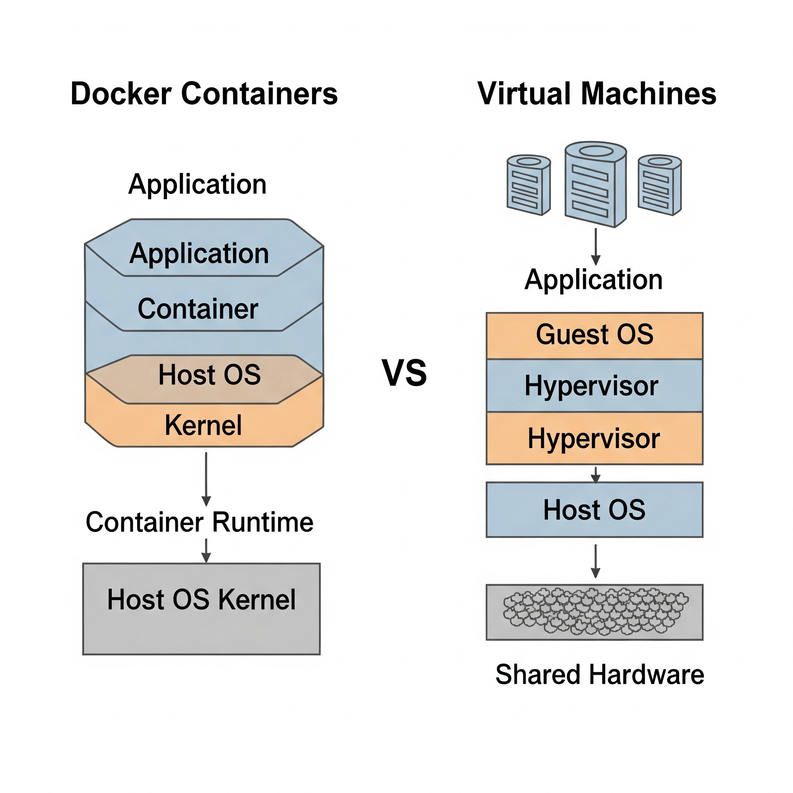

# Docker Basics: Your First Steps with Containers

Welcome to the world of Docker! This guide will walk you through the fundamental concepts of containerization and hands-on exercises to get you comfortable with Docker. Feel free to follow along, experiment, and come back to this guide whenever you need a refresher.

## Table of Contents

- [Docker Basics: Your First Steps with Containers](#docker-basics-your-first-steps-with-containers)
  - [Table of Contents](#table-of-contents)
  - [Understanding Docker: Why Containers?](#understanding-docker-why-containers)
    - [The "It Works on My Machine!" Problem](#the-it-works-on-my-machine-problem)
    - [Containers vs. Virtual Machines (VMs)](#containers-vs-virtual-machines-vms)
    - [Key Docker Components](#key-docker-components)
  - [Getting Hands-On: Basic Docker Operations](#getting-hands-on-basic-docker-operations)
    - [Verifying Your Docker Installation](#verifying-your-docker-installation)
    - [Spinning Up Your First Container](#spinning-up-your-first-container)
      - [Pulling an Image](#pulling-an-image)
      - [Running a Container (Interactive Mode)](#running-a-container-interactive-mode)
    - [Building Your Own: Basics of Writing a Dockerfile](#building-your-own-basics-of-writing-a-dockerfile)
      - [What is a Dockerfile?](#what-is-a-dockerfile)

---

## Understanding Docker: Why Containers?

Before we dive into commands, let's understand *why* Docker exists and what problems it solves.

### The "It Works on My Machine!" Problem

Have you ever heard (or said!) "It works on my machine!" during development or deployment? This common frustration arises because different environments (your laptop, a testing server, the production server) often have different operating systems, libraries, dependencies, and configurations. An application that runs perfectly in one place might fail in another due to these inconsistencies.

Docker aims to solve this by providing a consistent and isolated environment for your applications, no matter where they run.

### Containers vs. Virtual Machines (VMs)



This is a crucial concept to grasp. Both VMs and containers provide isolated environments, but they do so very differently.

**Think of it this way:**

* **Virtual Machines (VMs):** Imagine each VM is a **full house** built on its own plot of land. Each house has its own complete foundation, plumbing, and electricity (representing a full guest operating system, including its own kernel, libraries, and applications). They are very isolated, but also resource-heavy, as each house duplicates a lot of infrastructure.
    * **Resource Use:** High
    * **Boot Time:** Minutes
    * **Isolation:** Hardware-level
    * **Portability:** Less portable (larger)

* **Docker Containers:** Now, imagine containers as individual **apartments within a shared apartment building**. They share the building's core infrastructure (the host operating system's kernel) but have their own distinct, isolated living spaces (representing isolated user space, libraries, and your application). They are lightweight and efficient because they don't carry the overhead of a full guest OS.
    * **Resource Use:** Low
    * **Boot Time:** Seconds/Milliseconds
    * **Isolation:** OS-level
    * **Portability:** Highly portable (smaller, consistent)

**Here's a table summarizing the key differences:**

| Feature            | Virtual Machines (VMs)                       | Docker Containers                          |
| :----------------- | :------------------------------------------- | :----------------------------------------- |
| **Isolation Level** | Hardware-level (via Hypervisor)              | OS-level (via Docker Engine)               |
| **Operating System** | Each VM has its own full Guest OS            | Share the Host OS kernel                   |
| **Resource Usage** | High (each VM runs a full OS)                | Low (share kernel, lighter footprint)      |
| **Boot Time** | Minutes                                      | Seconds/Milliseconds                       |
| **Portability** | Less portable (larger image files)           | Highly portable (smaller images)           |
| **Typical Use Case** | Running different OS, strict hardware isolation | Microservices, rapid deployment, consistent dev environments |

**Advantages of Containers:**

* **Portability:** Your application and its environment are packaged together, so it runs consistently anywhere Docker is installed.
* **Efficiency:** Less resource consumption means you can run more applications on the same hardware.
* **Isolation:** Applications run in isolated environments, preventing conflicts between dependencies.
* **Scalability:** Easy to replicate and scale applications up or down as needed.
* **Faster Development Cycles:** Consistency across environments speeds up testing and deployment.

### Key Docker Components

To interact with Docker, it's helpful to know the basic components:

* **Docker Engine:** The core software that runs on your machine, responsible for building and running containers.
* **Docker Daemon:** A background service (part of the Docker Engine) that manages all Docker objects (images, containers, volumes, networks).
* **Docker Client:** The command-line interface (CLI) that you use to send commands to the Docker Daemon (e.g., `docker run`, `docker build`).
* **Docker Image:** A read-only template that contains your application and all its dependencies (code, libraries, runtime, configuration files). Think of it as a blueprint for your container.
* **Docker Container:** A runnable instance of a Docker Image. This is the actual running application in its isolated environment. You can create multiple containers from a single image.
* **Docker Hub / Registries:** Public or private repositories where Docker images are stored and shared. Docker Hub is the most popular public registry.

---

## Getting Hands-On: Basic Docker Operations

Let's put theory into practice! Make sure you have Docker Desktop (or Docker Engine for Linux) installed and running on your machine.

### Verifying Your Docker Installation

Open your terminal or command prompt and run these commands to ensure Docker is set up correctly:

1.  **Check Docker Version:**
    ```bash
    docker --version
    ```
    You should see output similar to `Docker version 24.0.5, build ced0996`.

2.  **Run a Test Container:**
    ```bash
    docker run hello-world
    ```
    This command pulls a tiny `hello-world` image from Docker Hub (if you don't have it locally) and runs a container from it. You should see a message indicating that your Docker installation appears to be working correctly. This confirms communication between your Docker client and the Docker daemon.

### Spinning Up Your First Container

Now, let's work with some slightly more functional containers.

#### Pulling an Image

Before you can run a container, you often need the image for it. Images are stored in registries like Docker Hub. You can explicitly `pull` an image, or Docker will automatically pull it when you try to `run` a container from it if it's not found locally.

1.  **Pull the `ubuntu` image:** This is a popular, lightweight Linux distribution.
    ```bash
    docker pull ubuntu:latest
    ```
    * `ubuntu`: The name of the image.
    * `:latest`: The tag for the image. `latest` usually refers to the most recent stable version. You can specify other tags like `:22.04` for a specific version.

2.  **List your local images:**
    ```bash
    docker images
    ```
    You should see `ubuntu` listed among your local images.

#### Running a Container (Interactive Mode)

We'll start an Ubuntu container and get an interactive shell inside it.

```bash
docker run -it ubuntu /bin/bash
```

Let's break this down:

`docker run`: The command to create and start a new container.

`-i`: Stands for interactive. Keeps STDIN (standard input) open, allowing you to type commands inside the container.

`-t`: Stands for pseudo-TTY (pseudo-terminal). Allocates a terminal for your container, making it feel like you're logging into a remote server.

`ubuntu`: The name of the image we want to use.

`/bin/bash`: The command to execute inside the container once it starts. In this case, it starts a Bash shell.

What happens:

Your terminal prompt will change, indicating you are now inside the running Ubuntu container.

Try these commands inside the container:

`ls -l /` (List contents of the root directory)

`pwd` (Print working directory)

`apt update` (Update package lists - you'll see Linux commands work)

`cat /etc/os-release` (See container's OS details)

To exit the container:
Type exit and press Enter. The container will stop, and your terminal prompt will return to normal.

### Building Your Own: Basics of Writing a Dockerfile
So far, we've used pre-built images. But how do you create an image for your own application? That's where the Dockerfile comes in.

#### What is a Dockerfile?
A Dockerfile is a simple text file that contains a set of instructions. Docker reads these instructions step-by-step to build a new Docker image. It's essentially a recipe for your application's environment.

Key benefits of a Dockerfile:

Reproducibility: Ensures that anyone building your image will get the exact same environment every time.

Version Control: You can store your Dockerfile in version control (like Git) alongside your code.

Automation: Automates the process of setting up dependencies and configurations.

Common Dockerfile Instructions
Let's look at the most common instructions you'll use:

`FROM`:

Purpose: Specifies the base image for your build. Every Dockerfile must start with FROM.

Example: `FROM python:3.9-slim` (Uses a minimal Python 3.9 image)

Tip: Always try to use a minimal, official, and trusted base image to keep your image size small and secure.

`WORKDIR`:

Purpose: Sets the working directory inside the container for any subsequent `RUN, CMD, ENTRYPOINT, COPY, or ADD` instructions.

Example: `WORKDIR /app` (All subsequent commands will run relative to `/app`)

`COPY`:

Purpose: Copies files or directories from your host machine (where you're building the image) into the image.

Example: `COPY . /app` (Copies everything from the current directory on your host to /app inside the image)

`RUN:`

Purpose: Executes commands during the image build process. Each RUN instruction creates a new layer in your image.

Example: `RUN apt-get update && apt-get install -y git` (Installs Git inside the image)

Tip: Chain multiple commands with && in a single RUN instruction to reduce the number of image layers and keep your image smaller.

`EXPOSE`:

Purpose: Informs Docker that the container listens on the specified network ports at runtime. This is purely informational and doesn't actually publish the port; you still need -p when running the container.

Example: `EXPOSE 80` (Indicates the application inside listens on port 80)

`ENV`:

Purpose: Sets environment variables inside the image. These variables will be available to your application when the container runs.

Example: `ENV MY_VARIABLE="hello"`

`CMD`:

Purpose: Provides default arguments for an executing container. There can only be one CMD instruction in a Dockerfile. If you specify multiple, only the last one takes effect.

Example: `CMD ["python", "app.py"]` (Runs app.py using python)

Note: `CMD` can be easily overridden when you run the container (e.g., docker run my-image /bin/bash).

`ENTRYPOINT`:

Purpose: Configures a container that will run as an executable. If `CMD` is also provided, it acts as arguments to the ENTRYPOINT.

Example: `ENTRYPOINT ["/usr/bin/supervisord"]` (Makes supervisord the main process)

Note: `ENTRYPOINT` is less commonly overridden than `CMD`.

BTW for wls `docker` commands will be `podman` instead.